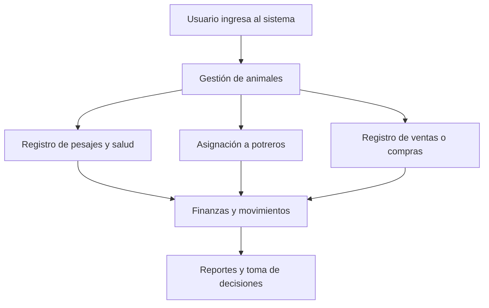

# Análisis del sistema de gestión ganadera

## 1. Visión general
Este proyecto está planteado como una aplicación web de gestión para un establecimiento ganadero familiar con enfoque de administración y trazabilidad. El sistema busca apoyar decisiones operativas y estratégicas para la crianza de bovinos, cubriendo:

- trazabilidad de bovinos con identificación SENASA
- control de preñez y partos
- seguimiento sanitario y vacunación
- registro de ventas y compras
- gestión financiera con ingresos y egresos
- control de potreros, pesajes y alimentación
- usuarios y roles del establecimiento

## 2. Arquitectura actual
La aplicación está construida con Django y Python, usando una arquitectura modular por apps:

- [animales](../animales)
- [establecimientos](../establecimientos)
- [finanzas](../finanzas)
- [inventario](../inventario)
- [sanidad](../sanidad)
- [usuarios](../usuarios)
- [web](../web)

El proyecto principal está definido en [SistemaGanaderia/settings.py](../SistemaGanaderia/settings.py) y las rutas principales en [SistemaGanaderia/urls.py](../SistemaGanaderia/urls.py) y [web/urls.py](../web/urls.py).

## 3. Módulos funcionales

### 3.1 Módulo de animales
El núcleo del sistema se encuentra en [animales/models.py](../animales/models.py).

Contiene entidades clave como:
- Animal: información principal del bovino, incluyendo caravana SENASA, datos de nacimiento, sexo, raza, peso, estado de venta, estado vivo/enfermo, y relaciones con parcela, dieta, madre y padre.
- Preniez: registro de gestaciones.
- Pesaje: historial de pesos.

Este módulo permite considerar al animal como un activo con historia y estado dinámico.

### 3.2 Módulo de establecimientos
En [establecimientos/models.py](../establecimientos/models.py) se gestiona:
- Establecimiento: unidad administrativa del campo.
- Parcela: potreros o áreas del establecimiento.

Esto permite asignar animales a potreros y modelar el movimiento físico entre zonas.

### 3.3 Módulo sanitario
En [sanidad/models.py](../sanidad/models.py) se manejan:
- Enfermedad
- Diagnostico
- EventoSanitario

Esto permite registrar vacunaciones, desparasitaciones, antibióticos, castración y seguimiento del estado sanitario del animal.

### 3.4 Módulo financiero
En [finanzas/models.py](../finanzas/models.py) se definen:
- MovimientoFinanciero: centraliza ingresos y egresos.
- Compra
- Venta

Este diseño favorece la trazabilidad contable y la integración entre ventas y movimientos de caja.

### 3.5 Módulo de inventario y alimentación
En [inventario/models.py](../inventario/models.py) se manejan:
- Insumo
- DetalleCompra
- Consumo
- Dieta
- ComposicionDieta
- RegistroAlimentacion

Esto aporta una base para la gestión de alimentos y de consumo por lote o parcela.

### 3.6 Módulo de usuarios
En [usuarios/models.py](../usuarios/models.py) se registran:
- Persona
- Veterinario
- Proveedor
- Comprador
- Usuario
- RolEstablecimiento

Permite modelar distintos actores del sistema y los roles dentro del establecimiento.

## 4. Flujo principal del sistema

## 5. Estado actual del proyecto
El proyecto ya cuenta con una base funcional bastante completa:
- modelos bien estructurados para cada dominio
- vistas y rutas principales para stock, finanzas, ventas, compras, vacunación, pesajes, potreros, usuarios y configuración
- lógica para registrar ventas y afectar el estado del animal
- integración de movimientos financieros y animales

Además, se validó la configuración del proyecto con Django, y el comando de verificación devolvió:
- "System check identified no issues (0 silenced)."

## 6. Fortalezas del diseño actual
- estructura modular por apps
- separación lógica entre dominio ganadero, sanitación, finanzas e inventario
- uso de relaciones claras entre animales, eventos, movimientos y finanzas
- enfoque orientado a un sistema funcional y no solo a un prototipo

## 7. Mejoras recomendadas para llevarlo a un nivel profesional
### 7.1 Autenticación y permisos
Implementar autenticación real con Django Authentication y roles como:
- gerente
- operador
- veterinario
- administrador

### 7.2 Formularios y validaciones de negocio
Agregar formularios con reglas específicas para:
- evitar inconsistencias entre venta y estado del animal
- limitar estados imposibles de un animal
- validar preñez, parto y vacunación con fechas coherentes

### 7.3 Reportes más completos
Incorporar reportes como:
- animales vendidos por periodo
- gastos por categoría
- ingresos por venta
- indicadores sanitarios y reproductivos
- stock por parcelas